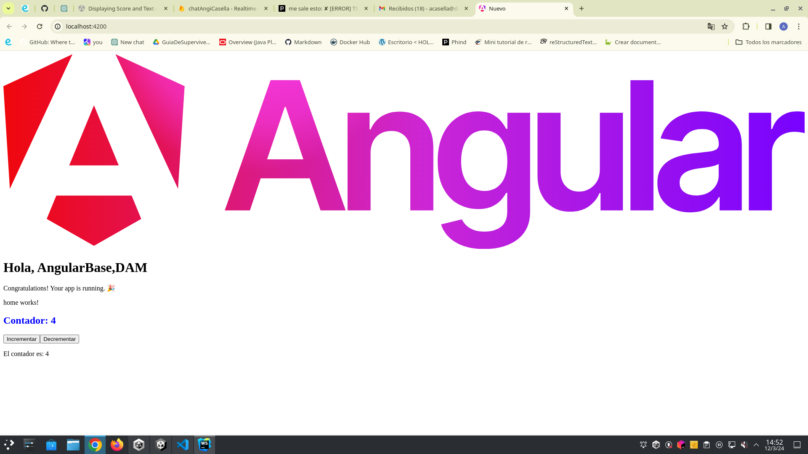

# Tarea: Angular básico

## Creación de Componente Contador

Para crear un contador simple en Angular se debe crear un componente
que tendrá la función de incrementar y decrementar un valor numérico mediante dos botones.

1. En el terminal me ubico en el directorio [src](./src):

   **dam2@A09equipo18:~/WebstormProjects/nuevo/src$** y ejecuto el siguiente comando: ```ng generate component contador```


2. En el archivo del componente [contador.component.ts](./src/contador/contador.component.ts) para incluir la lógica del 
contador se escribe el siguiente código para el componente:
```
import { Component } from '@angular/core';

@Component({
  selector: 'app-contador',
  templateUrl: './contador.component.html',
  styleUrls: ['./contador.component.css']
})
export class ContadorComponent {
  contador = 0;

  incrementar() {
    this.contador++;
  }

  decrementar() {
    if (this.contador > 0) {
      this.contador--;
    }
  }
}
```

3. En el archivo de plantilla HTML [contador.component.html](./src/contador/contador.component.html), 
para mostrar el contador y los botones para incrementar y decrementar:
```angular2html
<div>
  <h2>Contador: {{ contador }}</h2>
  <button (click)="incrementar()">Incrementar</button>
  <button (click)="decrementar()">Decrementar</button>
</div>
```

4. Escribir en el archivo de estilos CSS [contador.component.css](./src/contador/contador.component.css) 
para darle estilo al contador:
```
h2 {
  color: blue;
}
```

5. El componente del contador debe estar incluido en la aplicación.
Para hacer esto, en el archivo [app.component.html](./src/app/app.component.html) 
se debe añadir el selector del componente del contador:
```angular2html
<app-contador></app-contador>
```

6. Al ejecutar la aplicación Angular para ver el contador en acción:


## Añadir otro componente para usar la variable del componente anterior:
Para agregar otro componente que use la variable del componente contador y 
haga "algo" con dicha variable, siguiendo la relación padre-hijo, el componente padre 
será el contador y el componente hijo será el que recibe y utiliza la variable del contador.

1. Generar un nuevo componente hijo llamado [textoContador](./src/texto-contador):
```ng generate component textoContador```


2. Modificar el archivo del componente hijo [texto-contador.component.ts](./src/texto-contador/texto-contador.component.ts) 
para recibir la variable del componente padre mediante `@Input()`:
```
import { Component, Input } from '@angular/core';

@Component({
  selector: 'app-texto-contador',
  templateUrl: './texto-contador.component.html',
  styleUrls: ['./texto-contador.component.css']
})
export class TextoContadorComponent {
  @Input() contador: number = 0;
}
```

3. Modificar el archivo de plantilla HTML del componente hijo [texto-contador.component.html](./src/texto-contador/texto-contador.component.html) 
para mostrar la variable recibida:
```angular2html
<p>El contador es: {{ contador }}</p>
```

4. Modificar el archivo del componente padre [contador.component.html](./src/contador/contador.component.html) 
para pasar la variable al componente hijo usando la sintaxis de binding de propiedades:
```angular2html
<div>
  <h2>Contador: {{ contador }}</h2>
  <button (click)="incrementar()">Incrementar</button>
  <button (click)="decrementar()">Decrementar</button>
  <app-texto-contador [contador]="contador"></app-texto-contador>
</div>
```
En este punto, `[contador]="contador"` pasa la variable contador del componente padre al componente hijo.


5. Se debe asegurar de que el componente hijo esté incluido en la aplicación, como se muestra en el punto anterior.

6. Ejecutar la aplicación Angular para ver el contador y el componente hijo en acción:
   
